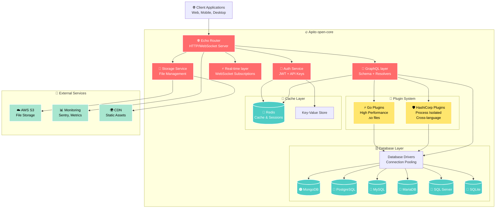

<p align="center">
  
</p>

# Apito open-core

**Build, scale, and ship GraphQL APIs with Apito open-core**

Apito open-core is the open-source GraphQL stack that turns your database into a production-ready API in minutes. Built with Go and designed for extensibility, it offers a plugin-first architecture that scales from prototype to demanding production workloads.

<p align="center">
  <a href="https://apito.io"><strong>Website</strong></a> ·
  <a href="https://docs.apito.io"><strong>Documentation</strong></a> ·
  <a href="https://discord.com/invite/fwHgF8pUpt"><strong>Discord</strong></a>
</p>

<p align="center">
  <a href="https://github.com/apito-io/engine/blob/main/LICENSE">
    
  </a>
  <a href="https://github.com/apito-io/engine/releases">
    
  </a>
  <a href="https://goreportcard.com/report/github.com/apito-io/engine">
    
  </a>
  <a href="https://github.com/apito-io/engine/actions">
    
  </a>
</p>

---

## Features

- **🚀 Instant GraphQL APIs** - Connect your database and get a production-ready GraphQL API instantly. [Docs](https://docs.apito.io/graphql)
- **🔌 Dual Plugin Architecture** - Extend functionality with both high-performance Go plugins and secure process-isolated HashiCorp plugins. [Docs](https://docs.apito.io/plugins)
- **🗄️ Multi-Database Support** - Works with MongoDB, PostgreSQL, MySQL, MariaDB, MSSQL, SQLite, and more with connection pooling. [Docs](https://docs.apito.io/databases)
- **🔐 Authentication** - JWT-based auth with role-based access control, API keys, and multi-tenant isolation. [Docs](https://docs.apito.io/auth)
- **⚡ Real-time Subscriptions** - WebSocket-based GraphQL subscriptions for live data updates. [Docs](https://docs.apito.io/subscriptions)
- **🎯 Custom Functions** - Serverless-style function execution within GraphQL queries and mutations. [Docs](https://docs.apito.io/functions)
- **📁 File Storage** - Built-in file upload and management with multiple storage backends. [Docs](https://docs.apito.io/storage)
- **🏢 Multi-Tenant SaaS** - Native support for building multi-tenant applications with data isolation. [Docs](https://docs.apito.io/multi-tenancy)
- **📊 Admin Dashboard** - Comprehensive dashboard for schema management, data browsing, and analytics.

### 🎯 Apito Console

<table>
<tr>
<td align="center" width="33%">

**📋 Model Management**  
<kbd></kbd>  
_Design your data models with an intuitive visual editor_

</td>
<td align="center" width="33%">

**📝 Content Management**  
<kbd></kbd>  
_Manage your content with a powerful admin interface_

</td>
<td align="center" width="33%">

**🚀 API Explorer**  
<kbd></kbd>  
_Test and explore your GraphQL APIs in real-time_

</td>
</tr>
</table>

> **Watch "releases"** of this repo to get notified of major updates.

## Quick Start

### One-Line Install (Easiest)

```bash
curl -fsSL https://raw.githubusercontent.com/apito-io/engine/main/open-core/install.sh | bash
```

This script automatically detects your platform (Linux/macOS, AMD64/ARM64) and installs the latest version.

### Using Docker (Recommended)

```bash
# Start with MongoDB (local)
docker run -p 8080:8080 -e DATABASE_ENGINE=mongodb \
  -e DATABASE_HOST=localhost -e DATABASE_PORT=27017 \
  -e DATABASE_USERNAME=admin -e DATABASE_PASSWORD=password \
  ghcr.io/apito-io/engine:latest

# Or with MongoDB Atlas (cloud)
docker run -p 8080:8080 -e DATABASE_ENGINE=mongodb \
  -e DATABASE_HOST=cluster0.xyz.mongodb.net \
  -e DATABASE_USERNAME=admin -e DATABASE_PASSWORD=password \
  ghcr.io/apito-io/engine:latest

# Or with PostgreSQL
docker run -p 8080:8080 -e DATABASE_ENGINE=postgresql \
  -e DATABASE_HOST=localhost -e DATABASE_PORT=5432 \
  ghcr.io/apito-io/engine:latest

# Or with MySQL/MariaDB
docker run -p 8080:8080 -e DATABASE_ENGINE=mysql \
  -e DATABASE_HOST=localhost -e DATABASE_PORT=3306 \
  ghcr.io/apito-io/engine:latest
```

### From Source

```bash
# Clone the repository
git clone https://github.com/apito-io/engine
cd engine/open-core

# Install dependencies
go mod tidy

# Start the server
go run main.go
```

### Using Pre-built Binaries

Download the latest release for your platform from [GitHub Releases](https://github.com/apito-io/engine/releases).

**Available Platforms:**

- `engine-linux-amd64.zip` - Linux x86_64
- `engine-linux-arm64.zip` - Linux ARM64 (Graviton, Raspberry Pi, etc.)
- `engine-darwin-amd64.zip` - macOS Intel
- `engine-darwin-arm64.zip` - macOS Apple Silicon (M1/M2/M3)

**Platform-specific Installation:**

<details>
<summary>🍎 macOS Apple Silicon (M1/M2/M3)</summary>

```bash
# Download and install
wget https://github.com/apito-io/engine/releases/latest/download/engine-darwin-arm64.zip
unzip engine-darwin-arm64.zip
chmod +x engine
./engine
```

</details>

<details>
<summary>🍎 macOS Intel</summary>

```bash
# Download and install
wget https://github.com/apito-io/engine/releases/latest/download/engine-darwin-amd64.zip
unzip engine-darwin-amd64.zip
chmod +x engine
./engine
```

</details>

<details>
<summary>🐧 Linux x86_64</summary>

```bash
# Download and install
wget https://github.com/apito-io/engine/releases/latest/download/engine-linux-amd64.zip
unzip engine-linux-amd64.zip
chmod +x engine
./engine
```

</details>

<details>
<summary>🐧 Linux ARM64 (AWS Graviton, Raspberry Pi)</summary>

```bash
# Download and install
wget https://github.com/apito-io/engine/releases/latest/download/engine-linux-arm64.zip
unzip engine-linux-arm64.zip
chmod +x engine
./engine
```

</details>

**Visit http://localhost:8080 to access the dashboard** 🚀

## How it works

open-core is a GraphQL-first stack that combines proven open-source technologies with a plugin architecture. It is designed to be extended through plugins while keeping performance and security in focus.

### Architecture

open-core uses a modern, cloud-native layout built for scalability:



**Core Components:**

- **🧠 GraphQL layer** - Built with [`graphql-go/graphql`](https://github.com/graphql-go/graphql) for dynamic schema generation and high-performance query execution
- **🌐 Echo Router** - High-performance HTTP router with middleware for REST endpoints and GraphQL over HTTP
- **🔌 Plugin System** - Dual architecture supporting both Go built-in plugins (`.so` files) and HashiCorp process-isolated plugins
- **🗄️ Database Drivers** - Multi-database support (MongoDB, PostgreSQL, MySQL, MariaDB, MSSQL, SQLite) with connection pooling and transaction management
- **🔐 Auth Service** - JWT-based authentication with RSA signing, API keys, and session management
- **⚡ Real-time layer** - WebSocket-based subscriptions for live data updates
- **📁 Storage Service** - File upload and management with multiple backend support

### Plugin Architecture

The dual plugin system combines:

#### Go Built-in Plugins (High Performance)

- **Shared Memory** - Direct memory access for maximum performance
- **Type Safety** - Compile-time type checking and Go's strong typing
- **Fast Execution** - No serialization overhead for critical operations

```go
// Example Go plugin
package main

import "github.com/apito-io/engine/interfaces"

var MyPlugin interfaces.NormalPluginInterface = &UploadPlugin{}

type UploadPlugin struct{}

func (p *UploadPlugin) ExecuteFunction(params map[string]interface{}) (interface{}, error) {
    // High-performance plugin logic
    return result, nil
}
```

#### HashiCorp Plugins (Security & Isolation)

- **Process Isolation** - Plugins run in separate processes for security
- **Crash Recovery** - Automatic restart on plugin failures
- **Language Agnostic** - Support for Go, JavaScript, Python, and more

```go
// Example HashiCorp plugin
func main() {
    plugin := &MyHashiCorpPlugin{}

    hcplugin.Serve(&hcplugin.ServeConfig{
        HandshakeConfig: plugins.HandshakeConfig,
        Plugins: map[string]hcplugin.Plugin{
            "my_plugin": &plugins.HashiCorpPluginRPC{Impl: plugin},
        },
        GRPCServer: hcplugin.DefaultGRPCServer,
    })
}
```

## Client Libraries

Build applications using our official and community SDKs:

| Language         | Official                                                        | SDK                                                                   | Plugin SDK |
| ---------------- | --------------------------------------------------------------- | --------------------------------------------------------------------- | ---------- |
| **🟢 Official**  |                                                                 |                                                                       |            |
| Go               | [go-internal-sdk](../go-internal-sdk)                           | [go-apito-plugin-sdk](../go-apito-plugin-sdk)                         | ✅         |
| JavaScript       | [js-internal-sdk](../js-internal-sdk)                           | [js-apito-plugin-sdk](../js-apito-plugin-sdk)                         | ✅         |
| **💚 Community** |                                                                 |                                                                       |            |
| Python           | [apito-py](https://github.com/apito-community/apito-py)         | [apito-plugin-py](https://github.com/apito-community/apito-plugin-py) | 🚧         |
| PHP              | [apito-php](https://github.com/apito-community/apito-php)       | -                                                                     | -          |
| C#               | [apito-csharp](https://github.com/apito-community/apito-csharp) | -                                                                     | -          |
| Swift            | [apito-swift](https://github.com/apito-community/apito-swift)   | -                                                                     | -          |

## Examples

### Creating Your First API

```bash
# Using the Apito CLI
apito create project -n fitnessApp

# Connect your database
apito db connect --engine postgresql --host localhost --port 5432

# Generate GraphQL schema from existing tables
apito schema generate

# Deploy locally
apito dev
```

### GraphQL Query Example

```graphql
# Query with real-time subscription
subscription {
  users(filter: { status: "active" }) {
    id
    name
    email
    posts {
      title
      createdAt
    }
  }
}

# Mutation with custom function
mutation {
  uploadUserAvatar(userId: "123", file: $file) {
    url
    thumbnails
    metadata
  }
}
```

### Plugin Development

Create custom functionality with minimal code:

```go
// main.go - Simple function plugin
package main

import (
    sdk "github.com/apito-io/go-apito-plugin-sdk"
)

func main() {
    // Initialize plugin
    plugin := sdk.Init("image-processor", "1.0.0", "your-api-key")

    // Register a custom function
    plugin.RegisterFunction("processImage", func(args map[string]interface{}) (interface{}, error) {
        imageUrl := args["url"].(string)
        // Process image logic here
        return map[string]interface{}{
            "processedUrl": processedUrl,
            "thumbnails": thumbnails,
        }, nil
    })

    // Register GraphQL mutation
    plugin.RegisterMutation("uploadImage", map[string]interface{}{
        "type": "ImageUploadResult",
        "args": map[string]interface{}{
            "file": sdk.NonNull(sdk.Upload),
            "size": sdk.StringArg(),
        },
        "resolve": "processImage",
    })

    // Start plugin
    plugin.Serve()
}
```

## Configuration

Apito can be configured via environment variables or `.env` file:

```env
# Database Configuration (choose one)
DATABASE_ENGINE=mongodb    # mongodb | postgresql | mysql | mariadb | mssql | sqlite

# MongoDB Configuration
DATABASE_HOST=localhost     # For Atlas: your-cluster.mongodb.net
DATABASE_PORT=27017         # Leave empty for MongoDB Atlas (uses SRV)
DATABASE_NAME=apito
DATABASE_USERNAME=admin     # Usually 'admin' for MongoDB
DATABASE_PASSWORD=password

# Other Database Ports
# DATABASE_PORT=5432        # PostgreSQL
# DATABASE_PORT=3306        # MySQL/MariaDB
# DATABASE_PORT=1433        # SQL Server

# Server Configuration
PORT=8080
HOST=0.0.0.0
ENV=development

# Authentication
PRIVATE_KEY_PATH=keys/private.key
PUBLIC_KEY_PATH=keys/public.key
JWT_TTL=24h

# Storage
STORAGE_ENGINE=local
STORAGE_PATH=./uploads

# Plugins
PLUGIN_DIR=./plugins
ENABLE_PLUGIN_SYSTEM=true

# Optional Services
REDIS_HOST=localhost
REDIS_PORT=6379
SENTRY_DSN=your-sentry-dsn
```

## Development

### Prerequisites

- Go 1.22 or higher
- Database (MongoDB, PostgreSQL, or MySQL)
- Redis (optional, for caching)

### MongoDB Setup & Troubleshooting

**Common Authentication Issues:**

If you get `auth error: sasl conversation error: unable to authenticate using mechanism "SCRAM-SHA-1"`, try:

1. **Check Username/Password**: Ensure credentials are correct
2. **Use admin database**: Most MongoDB users are created in the `admin` database
3. **Create user properly**:

   ```javascript
   // Connect to MongoDB shell
   mongo

   // Switch to admin database
   use admin

   // Create user with proper roles
   db.createUser({
     user: "admin",
     pwd: "password",
     roles: [
       { role: "userAdminAnyDatabase", db: "admin" },
       { role: "readWriteAnyDatabase", db: "admin" }
     ]
   })
   ```

4. **For MongoDB Atlas**: Use the connection string provided in Atlas dashboard
5. **For local MongoDB**: Ensure authentication is enabled in `mongod.conf`:
   ```yaml
   security:
     authorization: enabled
   ```

### Building from Source

```bash
# Clone the repository
git clone https://github.com/apito-io/engine
cd engine/open-core

# Install dependencies
go mod tidy

# Generate RSA keys for JWT
make keys

# Build the project
make build

# Run tests
make test

# Start development server
make dev
```

### Plugin Development

```bash
# Create a new plugin
mkdir plugins/my-plugin
cd plugins/my-plugin

# Initialize with SDK
go mod init my-plugin
go get github.com/apito-io/go-apito-plugin-sdk

# Build plugin
go build -o my-plugin.so -buildmode=plugin .

# Or build HashiCorp plugin
go build -o my-plugin ./main.go
```

## Contributing

We welcome contributions! Please see our [Contributing Guide](CONTRIBUTING.md) for details.

### Development Workflow

1. Fork the repository
2. Create a feature branch: `git checkout -b feature/amazing-feature`
3. Make your changes and add tests
4. Run the test suite: `make test`
5. Commit your changes: `git commit -m 'Add amazing feature'`
6. Push to the branch: `git push origin feature/amazing-feature`
7. Open a Pull Request

## Community & Support

- **💬 Discord Community** - Join our [Discord server](https://discord.gg/apito) for real-time discussions and support
- **📋 GitHub Issues** - Report bugs and request features on [GitHub Issues](https://github.com/apito-io/engine/issues)
- **💡 GitHub Discussions** - Share ideas and get help in [GitHub Discussions](https://github.com/apito-io/engine/discussions)
- **📚 Documentation** - Full documentation at [docs.apito.io](https://docs.apito.io)
- **🐛 Bug Reports** - Security issues should be reported to [security@apito.io](mailto:security@apito.io)

## Documentation

For comprehensive documentation, visit [docs.apito.io](https://docs.apito.io).

Key documentation sections:

- [🚀 Quick Start Guide](https://docs.apito.io/quick-start)
- [🔌 Plugin Development](https://docs.apito.io/plugins)
- [🗄️ Database Setup](https://docs.apito.io/databases)
- [🔐 Authentication](https://docs.apito.io/auth)
- [📡 GraphQL API](https://docs.apito.io/graphql)
- [🏗️ Architecture](https://docs.apito.io/architecture)

## License

This project is licensed under the Apache 2.0 License - see the [LICENSE](LICENSE) file for details.

## Badges

**Built with Apito**

[](https://apito.io)

```markdown
[](https://apito.io)
```

**Powered by Apito**

[](https://apito.io)

```markdown
[](https://apito.io)
```

---

<p align="center">
  Made with ❤️ by the Apito team and contributors
</p>

<p align="center">
  <a href="https://apito.io">Website</a> ·
  <a href="https://twitter.com/apito_io">Twitter</a> ·
  <a href="https://www.linkedin.com/company/apito-io">LinkedIn</a> ·
  <a href="https://github.com/apito-io">GitHub</a>
</p>
